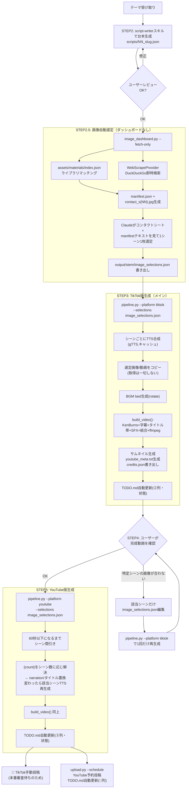
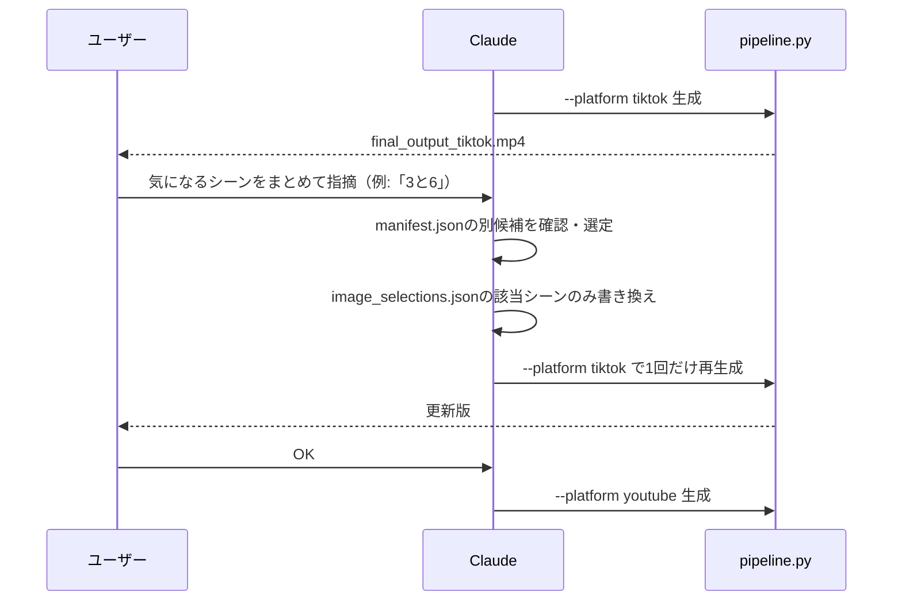

# 動画生成パイプラインの現状フロー（2026-07-19時点）

`video-maker` スキルが台本テーマ受け取りから投稿まで一気通貫で進める。以下はコードの実装（`src/pipeline.py` / `src/image_dashboard.py` / `.claude/skills/video-maker/SKILL.md`）を実際に読んで起こした現状フロー。

## 全体フロー

## 差し替えループの詳細（STEP4）

ダッシュボードでの事前確認を廃止（2026-07-18〜）したため、画像の良し悪しは**完成動画を見て**判断する。

---

## 使われていない／死んでいたコードパス

コードを実読して確認し、**2026-07-19に削除済み**:

| 項目 | 場所 | 対応 |
|---|---|---|
| `image_dashboard.py`の確認ダッシュボード一式（`generate_html`/`run_dashboard`/`_Handler`/`selections_to_preselect`/`log_selection_diffs`、`--preselect`/`--refresh` CLIフラグ） | `src/image_dashboard.py` | ✅ 削除済み。`fetch_only()`（候補取得＋コンタクトシート生成）のみ残す |
| `get_image_provider()` ファクトリ関数 | `src/images.py` | ✅ 削除済み（呼び出し元が存在しなかった） |
| `PinterestImageProvider`クラス | `src/images.py` | ✅ 削除済み（`get_image_provider()`経由でしか呼ばれず、そちらも死んでいたため道連れで削除） |
| `load_manifest()` | `src/image_dashboard.py` | ✅ 削除済み（`run_dashboard`削除で呼び出し元消滅） |

残置（削除しなかったもの・理由）:

| 項目 | 場所 | 理由 |
|---|---|---|
| 台本JSONの`meta.image_provider`フィールド | 全55台本 | データフィールドであり「処理」ではない。55ファイル一括編集のコストに対し実害がないため見送り。今後 script-writer スキルが新規に書かないようにするのは別途検討 |
| `StockImageProvider`・`WebScrapeProvider` | `src/images.py` | `material-collector`スキル（`collect_materials.py`）が実際に使用中 |
